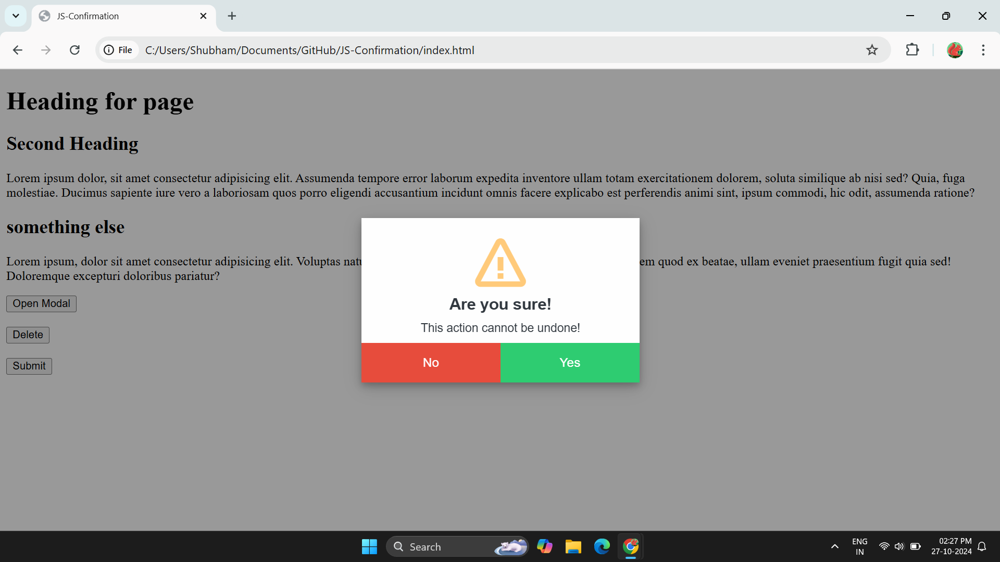
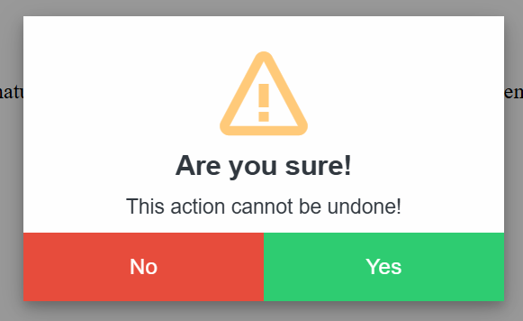
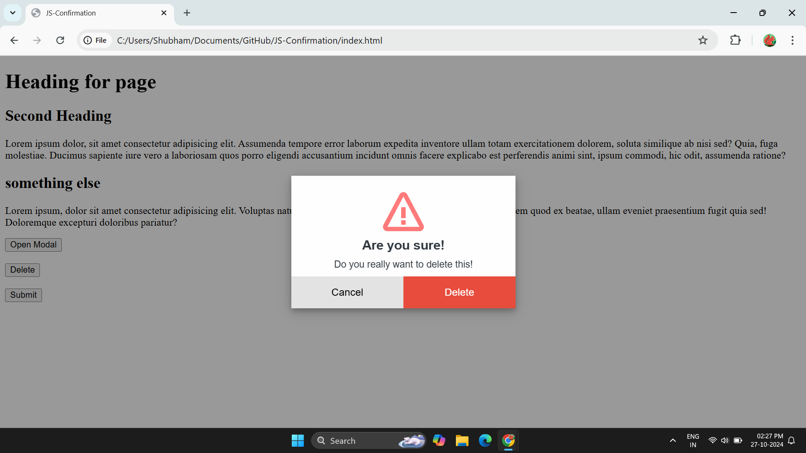
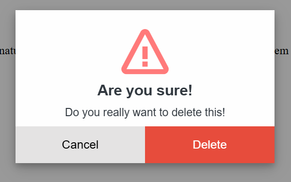
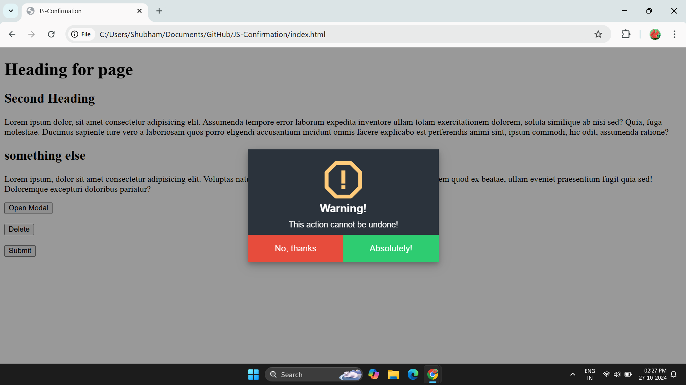
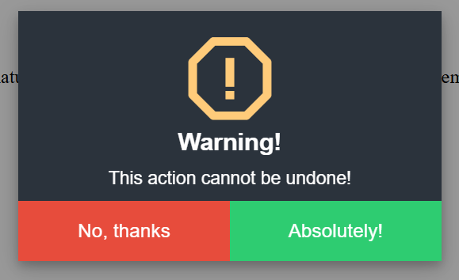

# JS-Confirmation
Confirm before performing any risky operation

## Images

<div style="display: flex;flex-direction: column; grid-gap: 10px;">
   <div style="display: flex; grid-gap: 10px;">
        
        
    </div>
     <div style="display: flex; grid-gap: 10px;">
        
        
    </div>
     <div style="display: flex; grid-gap: 10px;">
        
        
    </div>
</div>

## Usage 

To use this you need to link the stylesheet and script on your html file
<br><br>
For this case only i will suggest you to put them inside header tag, so the confirmation functionlity will available to your entire application.

```html
<head>
    <meta charset="UTF-8">
    <meta name="viewport" content="width=device-width, initial-scale=1.0">
    <title>JS-Confirmation</title>
    
    <!-- stylesheet -->
    <link rel="stylesheet" href="styles.css">

    <!-- icons -->
    <link href='https://unpkg.com/boxicons@2.1.4/css/boxicons.min.css' rel='stylesheet'>
    
    <!-- script -->
    <script type="text/javascript" src="script.js"></script>
</head>
```

### Ways to use 

1. **Delete Confirmation Through Form**

```html
<form action="https://www.google.com" onsubmit="deleteConfirmation(event)">
    <button type="submit">Delete</button>
</form>
```

2. **Form Submit Confirmation**

```html
<form action="https://www.google.com" onsubmit="formConfirmation(event)">
        <button type="submit">Submit</button>
</form>
```

3. **Conrimation Through JavaScript**
```js
let btn = document.getElementById('myBtn');
btn.onclick = async function () {
    const result = await Confirm.confirmationModal();

    if (result === 1) {
        console.log("Confirmed! Proceed with deletion.");
        // Perform operation

    } else {
        console.log("Cancelled! No action taken.");
        // Abort operation
    }

}
```


4. **Full Configured Conrimation Through JavaScript**
```js
let btn = document.getElementById('myBtn');
btn.onclick = async function () {
    const result = await Confirm.confirmationModal({
        icon: "bx bx-error-alt",
        iconColor: "#ffcb7a",
        title: "Warning!",
        message: "This action cannot be undone!",
        noBtnText: "No, thanks",
        yesBtnText: "Absolutely!",
        noBtnColor: "#fff",
        noBtnBackgroundColor: "#e74c3c",
        yesBtnColor: "#fff",
        yesBtnBackgroundColor: "#2ecc71",
        theme: "dark",                      // dark, light
        animation: "slide",                 // slide, flip, zoom, rotate
        backgroundEffect: "blackish"        // blackish, blur, none
    });

    if (result === 1) {
        console.log("Confirmed! Proceed with deletion.");
        // Perform operation

    } else {
        console.log("Cancelled! No action taken.");
        // Abort operation
    }

}
```

# Conclution
This project is currently under development. We will add more customizations in the near/far future.